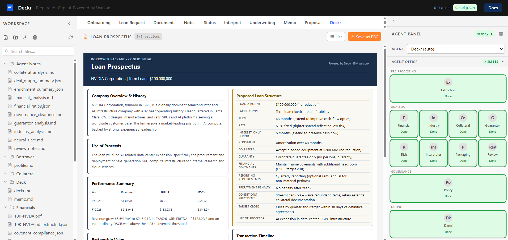

# Deckr

**Deckr is an agentic commercial loan packaging platform that turns raw financials into a complete credit memo and borrower prospectus.** Built for business owners and financial executives who need institutional-quality deal packaging — without the investment banker.

```
Enter Profile & Loan Terms  →  Upload Financials  →  Run Pipeline (~5 min)  →  Credit Memo  →  Loan Prospectus
```

A borrower runs the pipeline and gets:
- A 13-section **credit memorandum** written from the lender's perspective.
- A **loan prospectus sheet** structured from the lender's logic, calibrated to the borrower's advantage, and designed to attract competitive bids across lenders.

*Every agent output is editable. Human review is built in at every stage.*

**Built by Bankers. Powered by Watson.**

---

## Demo



🌐 **Live demo: [deckr-ai.com](https://deckr-ai.com)**

📖 **Documentation: [docs.deckr-ai.com](https://docs.deckr-ai.com)**

📄 **Demo instructions: [Demo_Instructions.pdf](https://www.dropbox.com/scl/fi/vmvgl7ivkcp48ac6r7yny/Demo_Instructions.pdf?rlkey=5oxn9ca88gti5kf7lh6jm0jms&st=p83o629w&raw=1)**

🎬 **Full walkthrough: [YouTube Demo](https://youtu.be/i48Wc26OdYc)**

📋 **Demo tester? [Usability Survey](https://docs.google.com/forms/d/e/1FAIpQLScIN5kWuCxVUXTBAOSukRI3YU9e78zcdfeyl5udJQUCh0VkQA/viewform?usp=publish-editor)**

---

## Agent Pipeline

```
Extraction → [Financial ‖ Industry ‖ Collateral ‖ Guarantor] → Risk → Interpreter → Packaging → Review → Policy → Deckr
```

| Agent | Output |
|-------|--------|
| Financial Data Extraction | `Financials/extracted_data.json` — structured financials parsed from uploaded PDFs · `Financials/financial_data_summary.md` — plain-text summary of extracted figures |
| Financial Analysis | `Agent Notes/financial_analysis.md` — 3-year income statement, balance sheet, and ratio spreads · `Agent Notes/financial_ratios.json` — machine-readable ratio data |
| Industry Analysis | `Agent Notes/industry_analysis.md` — sector overview, market conditions, and competitive position |
| Collateral | `Agent Notes/collateral_analysis.md` — collateral description, LTV estimate, and lien position assessment |
| Guarantor | `Agent Notes/guarantor_analysis.md` — personal financial review, ownership structure, and beneficial ownership flags |
| SLACR Risk | `SLACR/slacr.json` — numeric risk scores per dimension · `SLACR/slacr_analysis.md` — narrative risk rating with supporting rationale |
| Interpreter | `Agent Notes/neural_slacr.md` — explainable risk narrative and factor-level commentary |
| Packaging | `Deck/memo.md` — 13-section credit memorandum formatted for lender review |
| Review | `Agent Notes/review_notes.md` — completeness check, internal consistency flags, and missing data notes |
| Policy | `Agent Notes/governance_clearance.md` — regulatory compliance findings against ECOA, FHA, SBA, and OCC/FFIEC guidance |
| Deckr | `Deck/deckr.md` — one-page loan prospectus with optimized terms, structure, and key metrics |

All agents run through **IBM watsonx Orchestrate** (GPT-OSS 120B via AWS Bedrock).

**SLACR:** See [`frameworks/Credit_Risk_Framework.md`](frameworks/Credit_Risk_Framework.md).

---

## Stack

| Layer | Technology |
|-------|------------|
| Frontend | React 19 · TypeScript · Vite · Tailwind CSS v4 · `@carbon/charts-react` · Cytoscape.js |
| Backend | Python 3.10.11+ · FastAPI · SQLAlchemy · Alembic · chromadb · tenacity |
| AI | IBM watsonx.ai — GPT-OSS-120B · `ibm/slate-125m-english-rtrvr-v2` (embeddings) |
| Orchestration | IBM watsonx Orchestrate via ADK — 11 agents, 14 tool handlers |
| SQL | SQLite (local) → Cloud SQL PostgreSQL 15 + pgvector (cloud) — 30 tables, 7 views |
| Document Store | MongoDB Docker (local) → MongoDB Atlas (cloud) — 14 collections |
| Graph | Neo4j Docker / NetworkX fallback (local) → AuraDB (cloud) — Layers 5A/5B active |
| Vectors | ChromaDB (local) → pgvector (cloud) — document chunk RAG |
| Knowledge Base | IBM watsonx Orchestrate KB — `policy_regulatory_kb` (ECOA, FHA, SBA, OCC/FFIEC) |
| Storage | IBM Cloud Object Storage — bucket `deckr-workspace`, region `us-south` |
| Tunnel | ngrok static domain — exposes local backend to Orchestrate tool callbacks |

---

## Project Structure

```
borrower-underwriting-workspace/
├── backend/       # FastAPI · SQLAlchemy · Alembic · 11 Orchestrate agents
│                  # See backend/README.md for full structure, setup, and env vars
├── frontend/      # React 19 · TypeScript · Vite · Tailwind CSS v4
│                  # See frontend/README.md for full structure and setup
├── frameworks/    # Credit_Risk_Framework.md — SLACR source of truth
├── .gitignore
└── README.md
```

---

## Quick Start

**Requirements:** Python 3.10.11+ · Node.js 18+ · ngrok account

```powershell
# 1. Clone the repo
git clone https://github.com/agreenfield79/deckr.git
cd deckr

# 2. Backend
cd backend
python -m venv venv
.\venv\Scripts\Activate.ps1
pip install -r requirements.txt
cp .env.example .env        # fill in credentials
alembic upgrade head
uvicorn main:app --reload --port 8000

# 3. Frontend (new terminal)
cd frontend
npm install
npm run dev                 # http://localhost:5173

# 4. Expose backend to Orchestrate
ngrok http --domain=<your-ngrok-domain> 8000
```

## Setup

See **[`backend/README.md`](backend/README.md)** for backend setup, environment variables, Docker stack, and ngrok configuration.

See **[`frontend/README.md`](frontend/README.md)** for frontend setup and build instructions.

---

## Acknowledgements

Built with [IBM watsonx Orchestrate](https://www.ibm.com/products/watsonx-orchestrate) and [IBM watsonx.ai](https://www.ibm.com/products/watsonx-ai).

Agent orchestration powered by the watsonx Orchestrate ADK. Language models served via AWS Bedrock (GPT-OSS 120B). Embeddings via `ibm/slate-125m-english-rtrvr-v2`.

---

## License

© 2026 Alan Greenfield. All rights reserved.

This repository is made available for review and evaluation purposes only. No part of this codebase may be reproduced, distributed, or used without explicit written permission from the author.

---

## Security

- `backend/.env` and `backend/data/` are gitignored — never committed
- All IBM API calls are backend-only — credentials never reach the frontend
- Upload allowlist enforced — `.exe` / `.sh` rejected; 50 MB max
- All cloud secrets stored in GCP Secret Manager — never in environment files on Cloud Run
- Cloud Run endpoint is publicly accessible for the demo; `ALLOWED_ORIGINS` will be restricted to known domains post-demo
